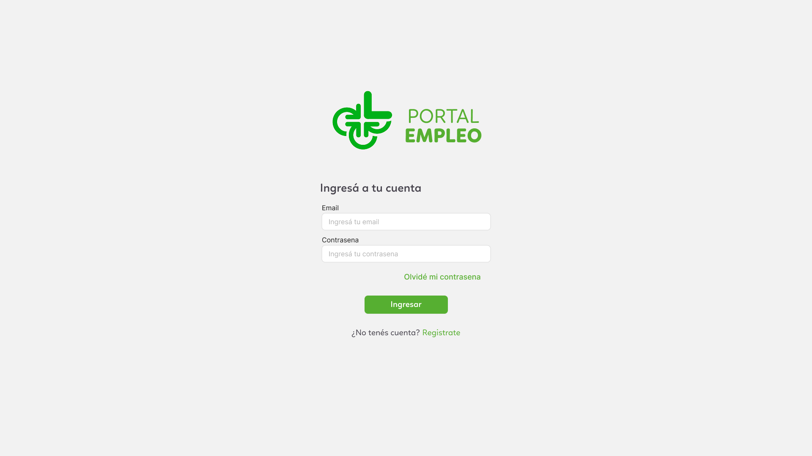
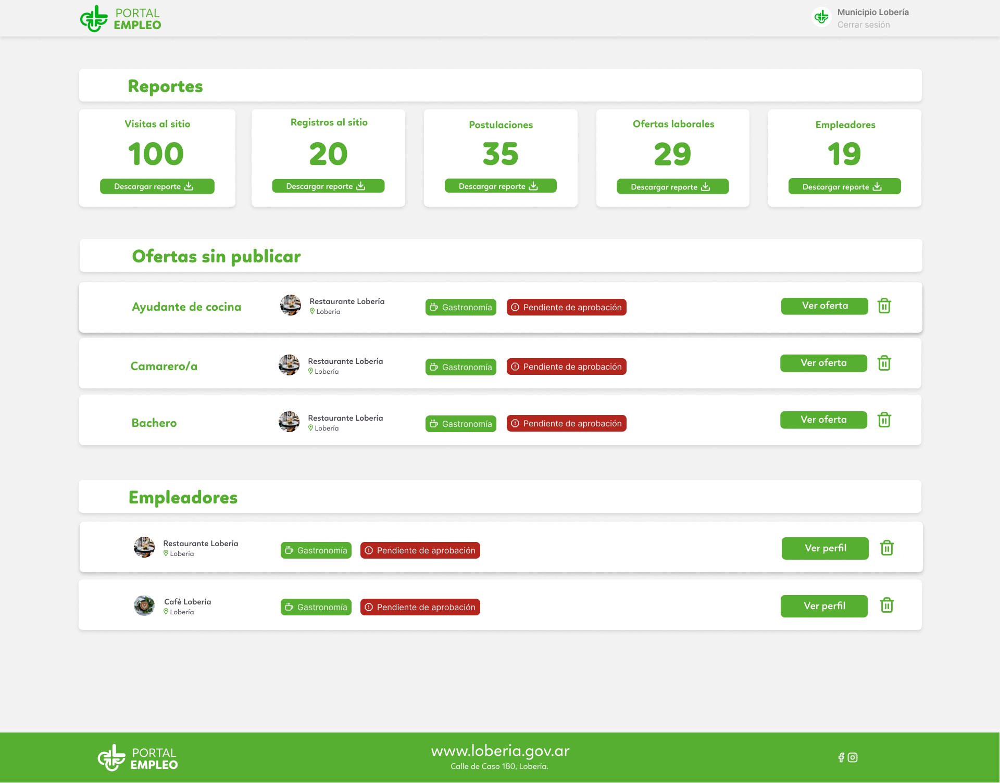
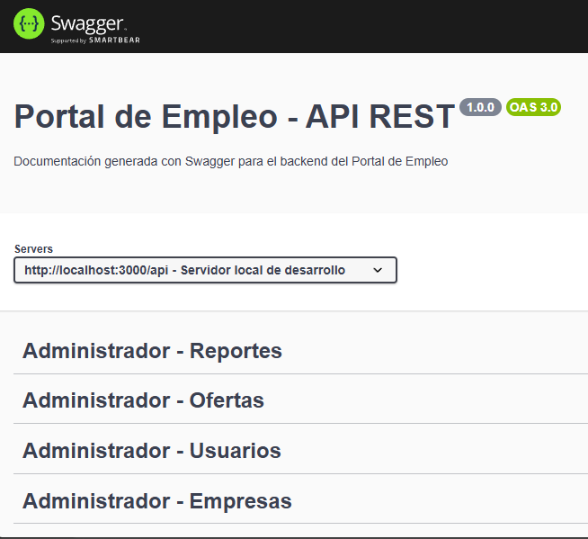
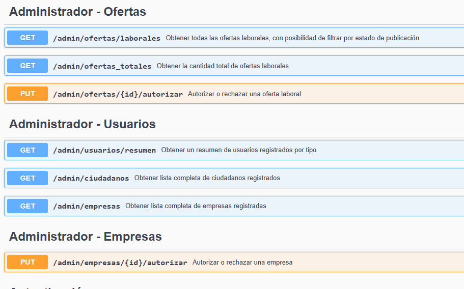
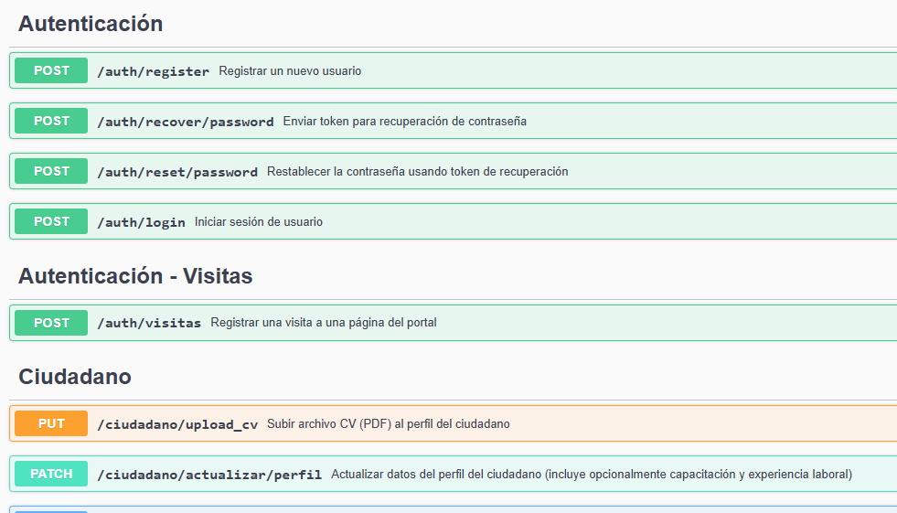
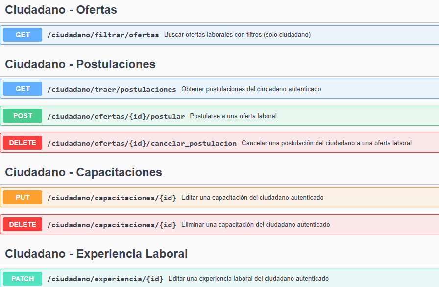
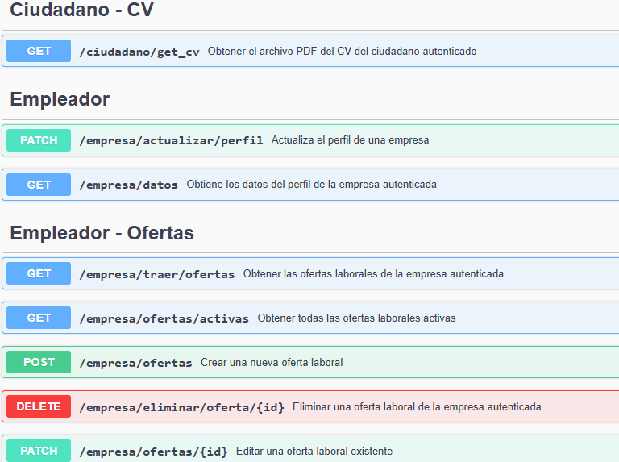

# 📌 Portal de Empleo Lobería

Plataforma web desarrollada como parte de una pasantía académica, con el objetivo de conectar ciudadanos en búsqueda de empleo con empresas locales, bajo la supervisión y colaboración del Municipio de Lobería.

---

## 🧭 Introducción

El **Portal de Empleo Lobería** es una solución digital para la gestión de ofertas laborales locales. Permite a los ciudadanos crear y mantener su currículum en línea, y a las empresas publicar sus búsquedas de personal, todo dentro de un entorno administrado por el municipio.

---

## 🎯 Objetivo general

Crear un sistema de intermediación laboral que facilite la conexión entre la oferta y demanda de trabajo en el partido de Lobería, promoviendo la empleabilidad mediante una herramienta digital accesible, moderna y segura.

---

## 👥 Público objetivo

- Ciudadanos en búsqueda activa de empleo.
- Empresas locales que ofrecen puestos laborales.
- Personal del municipio encargado de gestionar el portal.

---

## 🧰 Tecnologías utilizadas

- **Frontend:** Angular
- **Backend:** Node.js con Express
- **Base de Datos:** PostgreSQL (gestionada desde Supabase)
- **Cliente de base de datos / ORM:** Supabase-js
- **Control de versiones:** Git + GitHub
- **Herramientas de documentación:** Notion, Markdown
- **Otras herramientas:** Trello, dbdiagram.io, Figma .

---

## 📦 Alcance funcional

### ✔️ Funcionalidades incluidas:
- Registro y autenticación de usuarios (ciudadanos y empresas).
- Creación de currículum vitae en línea.
- Publicación de ofertas laborales por parte de empresas.
- Postulación a empleos por parte de ciudadanos.
- Panel de administración municipal para gestión de usuarios y ofertas.

### ❌ Exclusiones (fuera del alcance actual):
- Chat en tiempo real entre usuarios.
- Procesos de selección internos (entrevista, contratación).
- Estadísticas avanzadas o paneles analíticos.
- Integración con servicios de pago.

---

## 👨‍💻 Equipo de trabajo

- Luciana Zabaleta  
- Gisele Bartolo  
- Santiago Lázaro  
- Nahuel Caroseli  
- Analia Burgos  

---

# 📐 Diseño del Portal de Empleo

Para ver el diseño completo e interactivo:  
[🔗 Ver diseño en Figma](https://www.figma.com/proto/K7Q1OdzFcDaMqwZFJcMqdY/Portal-Empleo-Loberia?node-id=0-1&t=03AYvFDayHHGo0rx-1)

---

## 📝 Registro de Usuario

### 💻 Vistas Desktop
Capturas principales del flujo de registro y perfil desde un navegador.

| | |
|---|---|
|  |  |
|  |  |
|  |  |

---

### 📱 Vistas Mobile
Capturas adaptadas a dispositivos móviles, manteniendo la misma funcionalidad pero con diseño responsivo.

| | |
|---|---|
|  |  |
|  |  |


## 🔍 Ofertas Laborales

### 💻 Vistas Desktop
Pantallas principales del módulo de ofertas, tanto para postulantes como empleadores.

| | |
|---|---|
|  |  |
|  |  |

---

### 📱 Vistas Mobile
Diseños optimizados para pantallas pequeñas.

| | |
|---|---|
|  |  |


---

## 👔 Perfil Empleador

### 💻 Vistas Desktop
Panel del empleador para gestión de perfil y aprobación de empresa.

| | |
|---|---|
|  |  |

---

### 📱 Vistas Mobile
Versión móvil del perfil de empleador.

| | |
|---|---|
|  |


---

## 🛠️ Panel de Administración

### 💻 Vista Desktop
Interfaz de administración con herramientas de gestión y reportes.

| | |
|---|---|
|  |  |


## 📚 Documentación del Backend (JSDoc)

Este proyecto incluye documentación generada automáticamente con [JSDoc](https://jsdoc.app/) para los controladores y servicios del backend.

### 📄 Ver documentación

La documentación está disponible en: Backend/docs/index.html

### 🔍 ¿Cómo visualizarla?

1. Abrir el proyecto en Visual Studio Code.
2. Navegar hasta `Backend/docs/index.html`.
3. Hacer clic derecho sobre el archivo y elegir **"Open with Live Server"**.
   > O abrir directamente en el navegador con doble clic.

> ⚠️ Este archivo **no es la interfaz del sistema**, sino la **documentación técnica** del código backend generada automáticamente por JSDoc.

---

## 📚 Documentación Swagger

Podés explorar y probar todos los endpoints de la API desde Swagger:

[🔗 Ver Swagger](https://mi-dominio.com/api-docs)  
> Este enlace estará disponible cuando el backend esté desplegado en el servidor.

### 🖼️ Capturas de pantalla

| | | |
|---|---|---|
| <br>Vista general de los endpoints disponibles. | <br>Detalle de un endpoint con parámetros de entrada. | <br>Ejemplo de response de un endpoint. |
| <br>Vista de un endpoint protegido con token. | <br>Ejemplo de error y mensajes de validación. | |

------

## 🧪 Testing

El proyecto incluye pruebas automatizadas para garantizar el correcto funcionamiento de los endpoints del backend y la lógica de negocio.

### Tipos de tests

- **Unitarios**: pruebas de funciones individuales y lógica del backend.  
- **Integración / API**: tests de endpoints usando **Jest** y **Supertest**, incluyendo:
  - Endpoints de **ciudadanos**:
    - Subir CV
    - Actualizar perfil
    - Generar PDF
    - Obtener perfil completo
    - `PATCH /ciudadano/actualizar/perfil`
  - Endpoints de **empresas**:
    - Editar oferta (`PATCH /empresa/ofertas/:id`)
    - Aprobar ofertas y empresas
  - **Control de roles y permisos**: se verifica que usuarios no autorizados reciban errores 403 o 401 según corresponda.

- **Flujos encadenados**: pruebas que dependen de estados previos, por ejemplo:
  1. Aprobar una empresa/oferta
  2. Postulaciones a ofertas verificando permisos y estados

### Cómo ejecutar los tests

```bash
# Instalar dependencias si no se hizo
npm install

# Ejecutar todos los tests
npm test

# Ver cobertura de tests (si está configurado)
npm run test:coverage


----------


> 📝 **Nota:** Este documento forma parte de un proyecto académico de formación en desarrollo de software y tiene fines educativos.

------


## Tecnologías utilizadas

- Node.js (Backend REST API)  
- Angular (Frontend)  
- Supabase (Base de datos y autenticación)  
- Git (control de versiones)

---

## Instalación y ejecución local

### Requisitos previos

- Node.js (v16+) instalado  
- Angular CLI instalado (`npm install -g @angular/cli`)  
- Cuenta y proyecto configurado en Supabase  

### Pasos para ejecutar

1. Clonar el repositorio  
   ```bash
   git clone https://github.com/Lusiana444/PortalEmpleoLoberiaPPS.git
   cd PortalEmpleoLoberiaPPS

